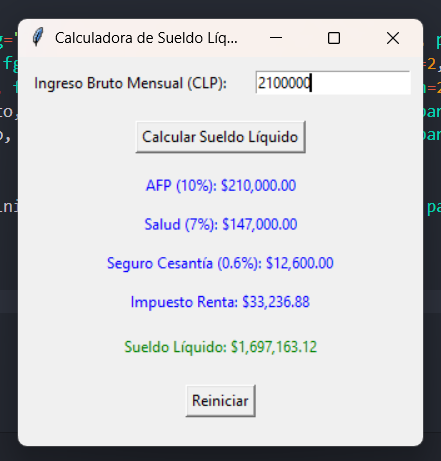

# Calculadora de Sueldo Líquido en Chile

Esta aplicación es una calculadora de sueldo líquido para trabajadores en Chile. Permite calcular las deducciones legales obligatorias (AFP, Salud, Seguro de Cesantía) e Impuesto Único de Segunda Categoría, y muestra el sueldo líquido final.

## Características

- **Cálculo de deducciones obligatorias:**
  - AFP (10%)
  - Salud (7%)
  - Seguro de Cesantía (0.6%)
  
- **Cálculo del Impuesto Único de Segunda Categoría:**  
  Según las tablas actualizadas del Servicio de Impuestos Internos (SII).

- **Interfaz gráfica amigable** creada con `Tkinter`.

- **Resultados detallados:** Muestra cada deducción por separado y el sueldo líquido resultante.

## Requisitos del Sistema

- Python 3.8 o superior
- Módulo `Tkinter` (instalado por defecto con Python)

## Instrucciones de Instalación y Uso

1. **Clonar o descargar el proyecto**:
    ```bash
    git clone https://github.com/EduardoAndres-IA/calculadoradeimpuestos.git
    ```

2. **Navegar al directorio del proyecto**:
    ```bash
    cd calculadoradeimpuestos
    ```

3. **Ejecutar el archivo principal**:
    ```bash
    python main.py
    ```

4. **Ingresar el ingreso bruto mensual** en la interfaz gráfica y presionar el botón "Calcular Sueldo Líquido".

5. **Reiniciar los campos** presionando el botón "Reiniciar" si deseas realizar otro cálculo.

## Capturas de Pantalla



## Cálculos Realizados

1. **AFP**: 10% del sueldo bruto.
2. **Salud**: 7% del sueldo bruto.
3. **Seguro de Cesantía**: 0.6% del sueldo bruto.
4. **Impuesto Único de Segunda Categoría**: Según las tablas vigentes del SII.
5. **Sueldo Líquido**: Diferencia entre el sueldo bruto y todas las deducciones.

## Consideraciones

- **Actualización de tasas y tramos**: Asegúrate de mantener las tablas de impuestos actualizadas según las disposiciones del SII.

- **Deducciones adicionales**: Este cálculo considera solo las deducciones estándar. Si existen deducciones adicionales o beneficios específicos, estos deben incluirse manualmente.

## Contribuciones

Si deseas contribuir, por favor sigue estos pasos:
1. Haz un fork del repositorio.
2. Crea una rama con tus cambios:
    ```bash
    git checkout -b mi-nueva-funcionalidad
    ```
3. Haz un pull request.

## Licencia

Este proyecto se encuentra bajo la licencia [MIT](https://opensource.org/licenses/MIT).

## Contacto

Para consultas o sugerencias, por favor contacta a [e.carrascocarter@gmail.com.com](mailto:ecarrascocarter@gmail.com).
